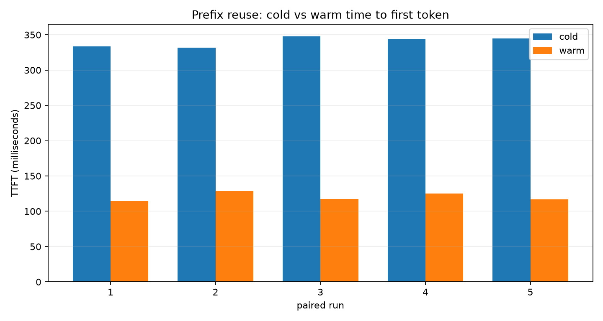

# nanoserve



On an M4 Mac with the default 0.5B 4-bit model, reusing a verified 576-token
prefix reduced median time to first token from **344.44 ms to 117.48 ms
(65.9%)**. Five paired runs produced token-identical greedy output and a 100%
cache hit rate. The raw evidence is committed in
[`results/published/cache_benchmark.json`](results/published/cache_benchmark.json).

`nanoserve` is a deliberately small MLX inference engine: a hand-written decode
loop, block-hashed prefix reuse, continuous batching, and an OpenAI-compatible
streaming server. The point is to expose the mechanism, not claim production
parity with vLLM.

## Run it

Requires Apple Silicon, macOS, and Python 3.11.

```bash
python3.11 -m venv .venv
source .venv/bin/activate
pip install -e '.[dev]'
nanoserve bench --runs 10
```

The default is `mlx-community/Qwen2.5-0.5B-Instruct-4bit`. No API key or paid
service is used.

```bash
nanoserve cache
nanoserve batch-bench
nanoserve baseline
nanoserve serve --port 8000
```

In another terminal:

```bash
curl -N http://127.0.0.1:8000/v1/completions \
  -H 'content-type: application/json' \
  -d '{"model":"nanoserve","prompt":"The capital of France is","max_tokens":16,"stream":true}'
```

The response is server-sent events followed by `data: [DONE]`; token chunks
arrive before request completion.

## Measured results

These are local point measurements, not universal hardware claims. They were
captured on an arm64 M4 Mac with Python 3.11 and the default model. Commands,
system metadata, percentile summaries, and per-request rows are committed under
`results/published/`.

| Experiment | p50 | p95 | p99 |
|---|---:|---:|---:|
| single-request TTFT, 10 runs | 252.57 ms | 382.81 ms | 423.94 ms |
| single-request TPOT, 10 runs | 11.38 ms | 16.75 ms | 19.54 ms |
| prefix reuse cold TTFT, 5 runs | 344.44 ms | 346.91 ms | 347.37 ms |
| prefix reuse warm TTFT, 5 runs | 117.48 ms | 127.91 ms | 128.44 ms |

Continuous batching uses one model forward for all active request rows:

| concurrency | requests | TTFT p50 | TTFT p95 | TTFT p99 | end-to-end p95 |
|---:|---:|---:|---:|---:|---:|
| 1 | 3 | 19.15 ms | 19.63 ms | 19.68 ms | 691.70 ms |
| 2 | 6 | 34.05 ms | 35.27 ms | 35.27 ms | 831.67 ms |
| 4 | 12 | 44.12 ms | 47.31 ms | 47.31 ms | 536.45 ms |
| 8 | 24 | 80.66 ms | 81.75 ms | 81.75 ms | 847.16 ms |

The single-request baseline uses the same loaded model, tokenizer, prompts,
greedy sampling, and requested token limit:

| implementation | latency p50 | throughput p50 |
|---|---:|---:|
| nanoserve | 1018.75 ms | 31.41 tok/s |
| `mlx_lm.generate` | 766.64 ms | 41.74 tok/s |

The reference implementation is faster, as expected. Nanoserve prefills in
fixed 64-token blocks to preserve cold/warm numerical identity, and its Python
loop synchronizes every token for honest timestamps. During autoregressive
decode, each step reads the model weights to produce one token, so the workload
is predominantly memory-bandwidth-bound. Batching improves weight reuse across
requests, while extra Python or sampling tricks cannot move the hardware
roofline by themselves.

Run the exact measurements with:

```bash
MPLCONFIGDIR=results/.mplconfig nanoserve bench --runs 10
MPLCONFIGDIR=results/.mplconfig nanoserve cache --runs 5
MPLCONFIGDIR=results/.mplconfig nanoserve batch-bench --runs 3
MPLCONFIGDIR=results/.mplconfig nanoserve baseline --runs 5
```

## Correctness before speed

Prefix keys hash token IDs in fixed blocks and chain every block to its parent,
model/tokenizer namespace, and cache-format version. Entries clone MLX arrays on
write and read. A digest match is also checked against the original token IDs.
The load-bearing integration test generates from cold full context and restored
prefix state and requires every greedy token ID to match.

```bash
pytest -o addopts='' -q -m integration
```

Read [`docs/architecture.md`](docs/architecture.md) for the request path and
[`docs/reading_notes.md`](docs/reading_notes.md) for cache invalidation details.

## Prior art and scope

The design was informed by pinned source reads of
[nano-vllm](https://github.com/GeeeekExplorer/nano-vllm/tree/bb823b3e06983d71485a8e1f23715ebd87d98ef8),
[vLLM v1 core](https://github.com/vllm-project/vllm/tree/a287eb163fb6f8f007a4a78411fb54c8dde64cc7/vllm/v1/core), and
[mlx-lm](https://github.com/ml-explore/mlx-lm/tree/cf10f962b7a20e63a6df43dbf0faf06070153d40).
Nanoserve does not implement paged attention, distributed KV transfer,
preemption, cancellation, speculative decoding, or CUDA. It is an M4-only
learning and portfolio engine, not a production serving system.

The measured local cost was zero incremental dollars because there were no API
or cloud calls. Any future cloud cost comparison must be **modeled at provider
list prices**, not presented as a bill or realized saving.

## Development

```bash
pytest
```

See [`docs/loom_script.md`](docs/loom_script.md) for the 90-second demo and
[`docs/portfolio_card.md`](docs/portfolio_card.md) for the concise project card.

MIT licensed.
