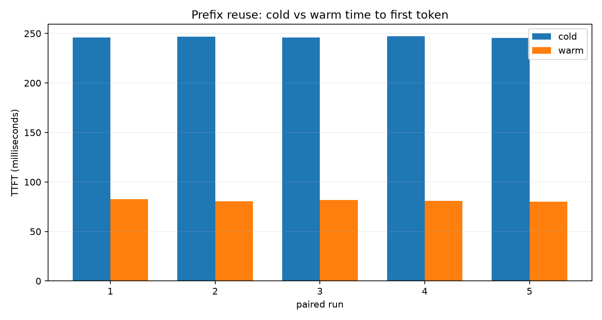

# nanoserve



On an M4 Mac with the default 0.5B 4-bit model, reusing a verified 576-token
prefix reduced median time to first token from **240.50 ms to 77.76 ms
(67.7%)**. Warm timing includes hash lookup and synchronized KV-array cloning.
Five paired runs produced token-identical greedy output, and all five warm
lookups hit the prepared prefix. The raw evidence is committed in
[`results/published/cache_benchmark.json`](results/published/cache_benchmark.json).

`nanoserve` is a compact MLX inference engine with a direct autoregressive
decode loop, block-hashed prefix reuse, continuous batching, and an
OpenAI-compatible streaming endpoint. Each mechanism is small enough to trace
from request admission to an evaluated token.

## Run it

Requires Apple Silicon, macOS, and Python 3.11 or 3.12.

```bash
python3.11 -m venv .venv
source .venv/bin/activate
pip install -e .
nanoserve bench --runs 10
```

The default is `mlx-community/Qwen2.5-0.5B-Instruct-4bit`. No API key or paid
service is used.

```bash
nanoserve cache
nanoserve batch-bench
nanoserve baseline
nanoserve serve --port 8000
```

In another terminal:

```bash
curl -N http://127.0.0.1:8000/v1/completions \
  -H 'content-type: application/json' \
  -d '{"model":"nanoserve","prompt":"The capital of France is","max_tokens":16,"stream":true}'
```

The response is server-sent events followed by `data: [DONE]`; token chunks
arrive before request completion.

## Measured results

These are local point measurements, not universal hardware claims. They were
captured on an arm64 M4 Mac with Python 3.11 and the default model. Commands,
system metadata, percentile summaries, and per-request rows are committed under
`results/published/`.

| Experiment | p50 | p95 | p99 |
|---|---:|---:|---:|
| single-request TTFT, 10 runs | 63.94 ms | 78.11 ms | 78.91 ms |
| single-request TPOT, 10 runs | 3.62 ms | 3.69 ms | 3.71 ms |
| prefix reuse cold TTFT, 5 runs | 240.50 ms | 241.37 ms | 241.54 ms |
| prefix reuse warm TTFT, 5 runs | 77.76 ms | 78.89 ms | 79.08 ms |

Continuous batching uses one model forward for all active request rows:

| concurrency | requests | TTFT p50 | TTFT p95 | TTFT p99 | end-to-end p95 |
|---:|---:|---:|---:|---:|---:|
| 1 | 3 | 18.69 ms | 18.78 ms | 18.78 ms | 200.45 ms |
| 2 | 6 | 33.66 ms | 34.13 ms | 34.13 ms | 228.04 ms |
| 4 | 12 | 45.49 ms | 47.04 ms | 47.04 ms | 268.77 ms |
| 8 | 24 | 79.85 ms | 80.76 ms | 80.76 ms | 387.07 ms |

The single-request baseline uses the same loaded model, tokenizer, prompts,
greedy sampling, and requested token limit:

| implementation | latency p50 | throughput p50 |
|---|---:|---:|
| nanoserve | 178.98 ms | 178.79 tok/s |
| `mlx_lm.generate` | 184.44 ms | 173.50 tok/s |

Pair order alternates to reduce thermal and order bias. The public
`mlx_lm.generate` API returns text, so the benchmark re-tokenizes its output;
all five rows produced the requested 32 tokens. `mlx_lm.generate` was faster in
the original run; nanoserve was 3.05% faster in this later paired run. This is
not a universal speed claim. Nanoserve uses fixed 64-token prefill blocks to
preserve cold/warm numerical identity. Decode is double-buffered with
`mx.async_eval()`, while scalar token access remains the timestamp
synchronization boundary. During autoregressive decode, each step reads the
model weights to produce one new token. Batching amortizes those reads across
active requests.

The direct-generation benchmark measured 23.19% lower TPOT and 18.82% higher
median nanoserve throughput. The continuously batched server uses a separate
scheduler loop, so these percentages are not server-throughput claims. The
complete before/after methodology, rejected
experiments, and limitations are in
[`docs/performance_optimization.md`](docs/performance_optimization.md); its
compact evidence is
[`results/published/optimization_benchmark.json`](results/published/optimization_benchmark.json).

Run the exact measurements with:

```bash
MPLCONFIGDIR=results/.mplconfig nanoserve bench --runs 10
MPLCONFIGDIR=results/.mplconfig nanoserve cache --runs 5
MPLCONFIGDIR=results/.mplconfig nanoserve batch-bench --runs 3
MPLCONFIGDIR=results/.mplconfig nanoserve baseline --runs 5
```

## Correctness gates

Prefix keys hash token IDs in fixed blocks and chain every block to its parent,
model/tokenizer namespace, and cache-format version. Entries clone MLX arrays on
write and read. A digest match is also checked against the original token IDs.
The load-bearing integration test generates from cold full context and restored
prefix state and requires every greedy token ID to match.

```bash
pytest -o addopts='' -q -m integration
```

Read [`docs/architecture.md`](docs/architecture.md) for the request path and
[`docs/reading_notes.md`](docs/reading_notes.md) for cache invalidation details.

## Prior art and scope

The design was informed by pinned source reads of
[nano-vllm](https://github.com/GeeeekExplorer/nano-vllm/tree/bb823b3e06983d71485a8e1f23715ebd87d98ef8),
[vLLM v1 core](https://github.com/vllm-project/vllm/tree/a287eb163fb6f8f007a4a78411fb54c8dde64cc7/vllm/v1/core), and
[mlx-lm](https://github.com/ml-explore/mlx-lm/tree/cf10f962b7a20e63a6df43dbf0faf06070153d40).
Nanoserve does not implement paged attention, distributed KV transfer,
preemption, cancellation, speculative decoding, or CUDA. The current release
has been tested on one M4 Mac and is not a production serving system.

No API or cloud provider was used, so this report makes no provider-cost claim.
Any future cloud cost comparison must be **modeled at provider list prices**,
not presented as a measured bill or realized saving.

## Development

```bash
pip install -e '.[dev]'
pytest
```

MIT licensed.
